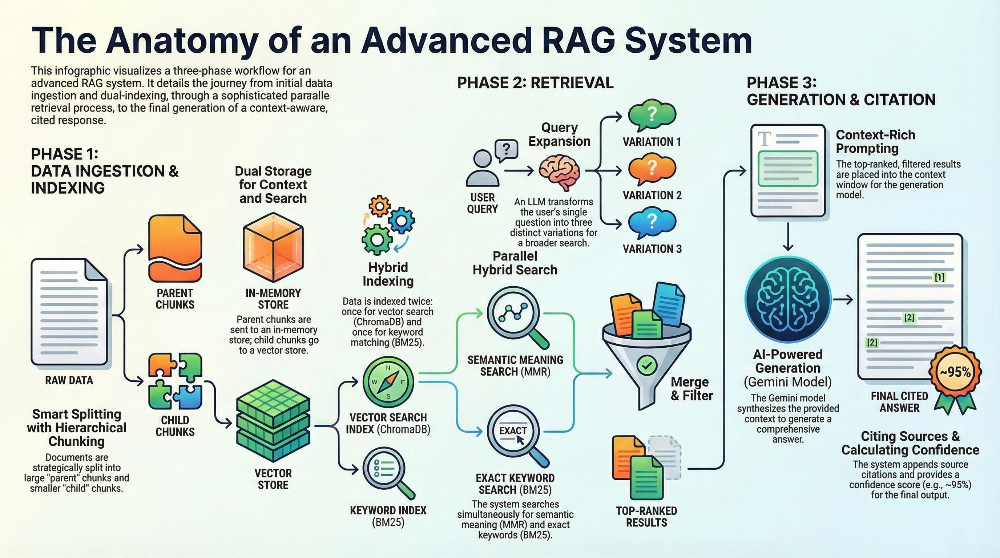

# Advanced Hybrid RAG System (Gradio)



A multi-thread, document-grounded Q&A app built with Gradio and LangChain. Each thread maintains an isolated Chroma collection, enabling parallel conversations over distinct PDF sets without cross-contamination.

## Features
- Threaded conversations with isolated vector stores per thread
- PDF ingestion with hierarchical or standard chunking + lightweight metadata
- Hybrid retrieval: BM25 + dense (HuggingFace) with MMR
- Contextual compression via Flashrank reranker
- History-aware retrieval and chat with Google Gemini
- Filters by section and page, optional query expansion
- Export conversation(s) to JSON, auto-excluded via .gitignore

## Requirements
- Python 3.10+
- Google API access for Gemini models
- Recommended: Windows, macOS, or Linux

Key libraries (installed via requirements.txt):
- gradio, langchain, langchain-google-genai, langchain-community, langchain-huggingface, chromadb, python-dotenv, pypdf

## Quick Start
1) Create and activate a virtual environment
- Windows (PowerShell):
```powershell
py -m venv .venv
.venv\Scripts\Activate.ps1
```
- macOS/Linux:
```bash
python3 -m venv .venv
source .venv/bin/activate
```

2) Install dependencies
```bash
pip install -r requirements.txt
```

3) Provide credentials
Create a `.env` file in the project root:
```env
GOOGLE_API_KEY=your_google_api_key_here
```

4) Run the app
```bash
python app2.py
```
Then open the local Gradio URL printed in the terminal.

## Usage
### Architecture Diagram
The diagram above illustrates the full pipeline across three phases: data ingestion/indexing, hybrid retrieval with query expansion and reranking, and context-rich generation with citations and confidence.

- Document Upload tab
  - Upload a PDF to the current thread
  - Choose Hierarchical Chunking and Metadata Extraction (recommended)
- Chat Interface tab
  - Ask questions about the PDFs uploaded to the active thread
  - Use Query Settings (query expansion, section/page filters)
  - Switching threads clears the chat display to avoid confusion
- Thread Management tab
  - Create/switch/delete threads
  - Each thread writes to a unique folder under `chroma_db_threads/<thread_id>`
- Export
  - Export current thread or all threads to `rag_*.json` (ignored by git)

Note: If the image does not render on GitHub, ensure the file exists at `assets/RAG_floe.png` with the exact same capitalization and that it is committed and pushed.

## Models and Limits
- Default LLM: `gemini-3-flash-preview` (via `langchain_google_genai`)
- If you hit free-tier rate limits (HTTP 429), consider switching to `gemini-1.5-flash` for higher free limits, or add billing to raise quotas.

## Data Storage
- Vector stores persist under `chroma_db_threads/<thread_id>`
- Chroma 0.4.x auto-persists; no manual `persist()` call needed
- Conversation exports: `rag_*.json` (git-ignored)

## Project Structure (key files)
- `app2.py` — Main Gradio app with threads, chat, upload, and exports
- `requirements.txt` — Python dependencies
- `chroma_db_threads/` — Per-thread Chroma collections
- `.env` — Local environment (API keys). Do not commit.

## Troubleshooting
- 429 RESOURCE_EXHAUSTED (quota):
  - Wait and retry, switch to a model with higher limits, or enable billing
- PDF not parsed well:
  - Try Hierarchical Chunking; ensure PDFs are text-based (not pure scans)
- Nothing returned / low confidence:
  - Increase number of documents or upload more relevant PDFs
  - Loosen filters or disable query expansion
- Environment variables not loading:
  - Ensure `.env` exists in project root and `python-dotenv` is installed

## Security & Privacy
- API keys are read from `.env` locally
- Uploaded PDFs and vector data remain on your machine unless you expose or share the app

## License
Add a license if you plan to distribute this project.

## Acknowledgments
Ziad Esmat, Zeyad Ayman, Tariq Ali